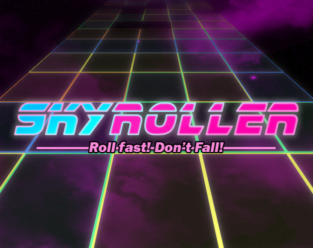

# DutchJam2026 — SkyRoller

SkyRoller is an entry for Dutch Game Jam 2026 (theme: “Don't stop moving”). It's a browser-based 3D endless-runner /
survival prototype built with TypeScript and Babylon.js, using a lightweight in-project engine layer for common game
infrastructure (scene management, asset pipeline, input, audio and simple entity systems).

Key links
- Game Page: https://sorskoot.itch.io/skyroller
- Jam page: https://itch.io/jam/dutch-game-jam-5-spring-2026



Overview
--------

The project demonstrates a minimal game architecture and gameplay loop: the player (a sphere) hops across scrolling
tiles on a five-lane highway and must avoid falling off. The engine layer (local packaged dependency) provides
foundational systems so the game code can focus on scene logic, entities and gameplay.

Quick highlights
- Language: TypeScript
- Rendering: Babylon.js
- Local engine: `lib/sorskoot-babylon-kit-0.1.3.tgz` (consumed as a dependency)
- License: MIT (see `LICENSE`) - note that music and graphics assets are not freely licensed;

Play / Controls
---------------

- Move lanes: Left / Right arrow keys or A / D
- Jump: Space
- Goal: Stay on the moving highway tiles and survive as long as possible

Development
-----------

Prerequisites

- Node.js (recommended: 22 or later)
- npm (or compatible client)

Install dependencies

```powershell
npm install
```

Run the dev server (Vite)

```powershell
npm run dev
# Opens the game at http://localhost:4623 by default
```

Build for production

```powershell
npm run build
```

Asset pipeline

The repository includes an asset pipeline script. To rebuild processed assets from `raw-assets/` into `public/assets/`:

```powershell
npm run assets
# or watch mode while editing raw assets
npm run assets:watch
```

Project structure
-----------------

- `src/` — game source code (scenes, entities, systems, utils)
  - `src/scenes/MainScene.ts` — main scene bootstrap
  - `src/entities/PlayerObject.ts` — player entity behaviour
  - `src/systems/TileScrollingSystem.ts` — tile pool and scrolling logic
- `public/` — built assets served to the browser (images, audio, GUI JSON)
- `raw-assets/` — original source assets used by the asset pipeline
- `lib/` — local packaged engine dependency (`sorskoot-babylon-kit` .tgz)

Architecture notes
------------------

- The game uses an engine layer (`@sorskoot/babylon-kit`) packaged locally; the engine exposes `Game`, `GameScene`,
  `GameObject` and several managers (asset, input, XR, etc.). See `AGENTS.md` for a short architecture summary.
- Scenes implement `async setup()` to prepare assets and UX, `update(deltaTime)` is used for per-frame logic.
- Systems are registered in a `gameSystems` singleton and accessed via `gameSystems.get('name')` where needed.

Contributing
------------

This repository is primarily a jam entry and is not currently intended for wide external contribution, but patches,
bug reports and small improvements are welcome via issues or pull requests. If you plan to modify the engine layer,
update the packaged `.tgz` in `lib/` and run `npm install` to refresh dependencies.

Known limitations
-----------------

- The engine layer is early-stage and not documented for public consumption.
- Some features (GUI, scoring, speed systems) are implemented as stubs and marked `TK` in the source.

Credits & Assets
----------------

- Music and graphical assets are third-party and not included under the project MIT license

License
-------

This code of the game is released under the MIT License. See the `LICENSE` file for details.

